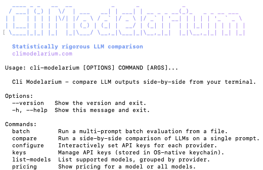

<picture>
  <source media="(prefers-color-scheme: dark)" srcset="docs/assets/cli-modelarium-wordmark-dark.svg">
  
</picture>

他の言語で読む: [English](README.md) | [Español](README.es.md) | [Français](README.fr.md) | [한국어](README.ko.md) | [中文](README.zh.md) | [Deutsch](README.de.md) | [Português](README.pt.md) | [Italiano](README.it.md)

注: このREADMEはアクセシビリティのために翻訳されています。Cli Modelarium CLI ツール自体は英語のみで出力されます。すべてのコマンド、エラーメッセージ、出力は、システムロケールに関係なく英語のままです。

> Note: Features added after v0.1.0 (`--runs` in v0.1.1, statistical significance in v0.1.2, confidence intervals/paired tests/McNemar in v0.1.3) are documented in English only — translations pending.

> 8つのクラウドプロバイダー＋ローカルモデルのLLM出力をターミナルから横並びで比較。並列ストリーミング、バッチ評価、LLM-as-judgeスコアリング、ハルシネーション検出、CI/CD対応のアサーション機能を搭載。

[](https://github.com/lavellehatcherjr/Cli-Modelarium/actions/workflows/ci.yml)
[](https://pypi.org/project/cli-modelarium/)
[](LICENSE)
[](https://www.python.org/downloads/)
[](#)

<p align="center">
  
</p>

## 概要

**Cli Modelarium** は、プロバイダー、モデル、システムプロンプト、温度パラメータ間でLLM出力を比較するための洗練されたコマンドラインツールです。ライブ並列ストリーミング、バッチ評価、決定論的テスト、品質スコアリングが組み込まれています。

特定のタスクに適したモデルの評価、CI/CDでのプロンプト回帰テストの実行、ローカルモデルとクラウドAPIの比較、評価データセットの構築などに役立ちます。すべて1つのターミナルコマンドから実行できます。

## クイックスタート

```bash
pip install cli-modelarium

# APIキーを設定（OSキーチェーンに安全に保存されます）
cli-modelarium configure

# 初めての比較を実行
cli-modelarium "Explain quantum computing in one sentence" \
  --models gpt-5.5,claude-opus-4-7,gemini-3.1-pro \
  --temperatures 0,0.7
```

これだけです。3つのモデルすべてがレスポンスを並列でライブストリーミングし、レイテンシー、トークン数、コストがクリーンな比較テーブルに表示されます。

## 機能

### 🤖 プロバイダー（8つのクラウド＋無制限のローカル）

- **クラウドプロバイダー:** OpenAI、Anthropic、Google (Gemini)、xAI (Grok)、DeepSeek、Mistral、Groq、OpenRouter
- **ローカルモデル:** Ollama、LM Studio、vLLM、llama.cpp - OpenAI互換のローカルサーバーすべて
- 同じ比較内でローカルモデルとクラウドモデルを混在可能
- 呼び出しごとに設定可能なモデル選択（ハードコードされたリストはありません）

### ⚡ 並列ストリーミング

- すべてのモデルにわたって同時にトークン単位でライブ表示
- モデルごとのTime-to-First-Token (TTFT) トラッキング
- どのモデルが最初に終了するかを確認し、出力の分岐をリアルタイムで観察
- 8つのプロバイダーすべてからストリーミング（内部ではSSEを使用）

### 📊 複数の比較モード

- **単一プロンプト vs. 複数モデル** - 「どれが最良か？」を素早く比較
- **単一プロンプト vs. 複数の温度パラメータ** - ランダム性が出力に与える影響を確認
- **複数のシステムプロンプト vs. 単一のユーザープロンプト** - プロンプトエンジニアリングのA/Bテスト
- **バッチモード** - 実際の評価作業のためのマルチプロンプト × マルチモデル
- **ローカル vs. クラウドの比較** - ギャップ（あるいはその欠如）を定量化

### 🧪 評価機能

- **決定論的アサーション** - 10種類のアサーションタイプ（`contains`、`regex`、`json_valid`、`json_schema`、`max_length_chars`、`latency_under`、`cost_under` など）、合格/不合格の出力とCI終了コード
- **LLM-as-a-judge スコアリング** - 1つのLLMを使用して、他のLLMの出力を品質基準に基づいて評価
- **ジャッジパネル** - 複数のジャッジでスコアを平均化し、バイアスの少ない評価を実現
- **ハルシネーション検出プリセット** - 事実の正確性チェックのための、すぐに使える基準
- **カスタム基準** - 独自のスコアリングルーブリックを定義
- **自己評価の自動スキップ** - ジャッジモデルが評価対象でもある場合、自動的にスキップされます

### 💾 出力フォーマット

- **ライブターミナル** - プログレスバーとストリーミング表示を備えたRichベースのパネル
- **CSV** - スプレッドシート対応（Excel、Google Sheets、pandasで開く）
- **JSON** - スクリプトとパイプライン向けに構造化
- **Markdown** - ブログ記事やレポート向けの美しいテーブル
- **終了コード** - CI/CD向けに合格/不合格ステータスを反映する 0/1/2

### 💰 コスト透明性

- 各プロバイダーが報告する使用状況からの呼び出しごとのコスト表示
- 比較ごとの合計コストサマリー
- LLM-as-judgeが有効な場合、ジャッジコストを別途表示
- ローカルモデルは「Free」と表示
- 予期せぬ請求を防ぐ `--max-cost` フラグ

### 🔒 セキュリティ

- APIキーは `keyring` 経由でOSネイティブのキーチェーンに保存（Mac Keychain、Windows Credential Manager、Linux Secret Service）
- 形式検証により、保存前にペーストエラーをキャッチ
- エラーメッセージのリダクションにより、トレースバックでのキーリークを防止
- ローカルモデルURLのlocalhost専用検証
- 責任ある開示ポリシーを記載した `SECURITY.md`

### 🛡️ レート制限処理

- プロバイダーごとの同時実行制限（デフォルト5）ですべてのティアのベースラインを尊重
- 指数バックオフによる自動429リトライ
- Anthropicの529「overloaded」はレート制限とは別に処理
- 上位ティアのパワーユーザー向けの `--concurrency` フラグ
- モデルごとの優雅な失敗処理（他のモデルは継続）

### 🌐 クロスプラットフォーム

- macOS、Windows（10+およびARM）、Linuxで同一の動作
- すべてのファイルI/Oは `pathlib` + 明示的なUTF-8エンコーディングを使用
- CSV書き込みはWindows互換性のため `newline=""` を使用
- Python 3.11+ が必要

### 📋 開発者体験

- **シングルCLIバイナリ** - `pip install cli-modelarium` で完了
- **洗練されたRichベースのUI** - Claude Codeレベルのターミナルポリッシュ
- **JSON出力** - 何にでもパイプ可能（`jq`、スクリプト、モニタリング）
- **CI/CD対応** - 終了コード、構造化出力、GitHub Actionsのサンプル付属
- **Apache 2.0 ライセンス** - 商用・非商用を問わず、あらゆるプロジェクトで使用可能

## 例

### コーディングタスクで3つのモデルを比較

```bash
cli-modelarium "Write a Python function to find the longest palindromic substring" \
  --models gpt-5.5,claude-opus-4-7,gemini-3.1-pro
```

### アサーション付きバッチ評価

`eval.json` を作成:

```json
[
  {
    "id": "math-1",
    "prompt": "What is 2 + 2?",
    "assertions": [
      {"type": "contains", "value": "4"},
      {"type": "max_length_chars", "value": 100}
    ]
  },
  {
    "id": "json-1",
    "prompt": "List 3 colors in JSON array format",
    "assertions": [
      {"type": "json_valid"}
    ]
  }
]
```

実行:

```bash
cli-modelarium batch eval.json \
  --models gpt-5.5,claude-opus-4-7 \
  --output results.csv
```

### LLMジャッジによる出力のスコアリング

```bash
cli-modelarium "Explain recursion in one paragraph" \
  --models gpt-5.5,claude-opus-4-7,gemini-3.1-pro,local/llama-3.3-70b \
  --judge claude-opus-4-7 \
  --judge-criteria "accuracy,clarity,brevity"
```

### 既知の事実に対するハルシネーション検出

```bash
cli-modelarium "Tell me about the Eiffel Tower" \
  --models gpt-5.5,claude-opus-4-7 \
  --judge claude-opus-4-7 \
  --check-hallucination \
  --expected-facts "Built 1887-1889,Located in Paris France,Designed by Gustave Eiffel"
```

### ローカルモデルとクラウドAPIの比較

```bash
# まずOllamaを起動: ollama run llama3.3
cli-modelarium "Summarize the key features of microservices architecture" \
  --models local/llama-3.3-70b,gpt-5.5,claude-opus-4-7
```

### CI/CDで実行（GitHub Actionsの例）

```yaml
- name: Run LLM evaluation
  env:
    OPENAI_API_KEY: ${{ secrets.OPENAI_API_KEY }}
    ANTHROPIC_API_KEY: ${{ secrets.ANTHROPIC_API_KEY }}
  run: |
    cli-modelarium batch ./eval/test_suite.json \
      --models gpt-5.5,claude-opus-4-7 \
      --output eval_results.json \
      --min-pass-rate 0.90
```

合格率が90%を下回ると、コマンドは終了コード1で終了し、ビルドが失敗します。

## 設定

### APIキー

Cli Modelarium はAPIキーをOSネイティブのキーチェーン（Mac Keychain、Windows Credential Manager、`keyring` 経由のLinux Secret Service）に保存します。キーが平文でディスクに触れることはありません。

```bash
# インタラクティブセットアップ（推奨）
cli-modelarium configure

# または個別に設定
cli-modelarium keys set openai
cli-modelarium keys set anthropic
cli-modelarium keys set google

# 設定済みのキーを確認
cli-modelarium keys list

# キーを削除
cli-modelarium keys delete openai
```

環境変数も使用できます（CI/CDに便利）:

```bash
export OPENAI_API_KEY=sk-...
export ANTHROPIC_API_KEY=sk-ant-...
export GOOGLE_API_KEY=...
```

環境変数はキーチェーンストレージよりも優先されます。

### ローカルモデル（Ollama、LM Studio など）

ローカルモデルはOpenAI互換エンドポイント経由で動作します - APIキーは不要です。ツールはOllamaのデフォルトポートを自動検出します。

```bash
# デフォルト: Ollamaがlocalhost:11434にあると想定
cli-modelarium "test" --models local/llama-3.3

# 代わりにLM Studioを使用
cli-modelarium "test" --models local/qwen-3-32b --local-url http://localhost:1234/v1

# カスタムローカルURLをデフォルトとして保存
cli-modelarium keys set local --base-url http://localhost:1234/v1
```

## サポートされているプロバイダー

| プロバイダー | APIキー必要 | ストリーミング | コストトラッキング |
|----------|-----------------|-----------|---------------|
| OpenAI (GPT-5, GPT-5 mini, o3, o4-mini, など) | ✅ | ✅ | ✅ |
| Anthropic (Claude Opus 4.7, Sonnet 4.6, Haiku 4.5, など) | ✅ | ✅ | ✅ |
| Google (Gemini 3.1 Pro, Gemini 3 Flash, など) | ✅ | ✅ | ✅ |
| xAI (Grok 4.1, など) | ✅ | ✅ | ✅ |
| DeepSeek (V3, R1) | ✅ | ✅ | ✅ |
| Mistral (Large, Medium, Small) | ✅ | ✅ | ✅ |
| Groq (Llama, Mixtral, など) | ✅ | ✅ | ✅ |
| OpenRouter (プラットフォーム上のすべてのモデル) | ✅ | ✅ | ✅ |
| **ローカル: Ollama** | ❌ | ✅ | 無料 |
| **ローカル: LM Studio** | ❌ | ✅ | 無料 |
| **ローカル: vLLM** | ❌ | ✅ | 無料 |
| **ローカル: llama.cpp server** | ❌ | ✅ | 無料 |

現在サポートされているすべてのモデルを確認するには `cli-modelarium list-models` を実行してください。

## 仕組み

Cli Modelarium は、OpenAIの `messages` 配列、Anthropicのトップレベル `system` パラメータ、Googleの `system_instruction` など、API間の違いを隠すモジュラーなプロバイダー抽象化レイヤーを使用しています。すべてのプロバイダーは同じ非同期ストリーミングインターフェースを実装しているため、CLIは `asyncio.gather()` ですべてを並列に実行できます。

コスト計算は、各プロバイダーが報告する `usage` フィールド（入力トークン、出力トークン、キャッシュされたトークン）に現在の価格定数を乗算して算出されます。価格データは **2026年5月25日** に公式プロバイダードキュメントから検証されました - 注意事項については [注意事項と制限](#注意事項と制限) を参照してください。

ローカルモデルの場合、Ollama、LM Studio、vLLM、llama.cpp はすべてOpenAI互換のRESTエンドポイントを公開しているため、カスタム `base_url` を使用した同じOpenAI Python SDKが使用されます。

## 注意事項と制限

### 価格データ

Cli Modelarium に組み込まれているすべての価格は、**2026年5月25日** に公式プロバイダードキュメントから検証されました。LLMの価格は頻繁に変更されます（時には月単位で）。ツールは各出力に `pricing_as_of` 日付を表示します。予算編成や本番環境の決定にコスト計算を信頼する前に、必ず各プロバイダーの公式価格ページと照合してください。

### レート制限

レート制限処理とデフォルトのプロバイダーごとの同時実行設定は、**2026年5月25日** に検証されたプロバイダーのレート制限に基づいています。お客様の特定のティアの制限は、ここで想定されているデフォルトとは異なる場合があります。本番環境のキャパシティ前提を構築する前に、プロバイダーの公式ダッシュボードと現在の制限を照合してください。

### モデルの利用可能性

Cli Modelarium がサポートするモデルは、**2026年5月25日** にプロバイダーが提供していたものを反映しています。プロバイダーは定期的に新しいモデルをリリースし、古いモデルを廃止し、機能を調整しています。レジストリ内のモデルが動作しなくなった場合は、`cli-modelarium list-models` を実行し、プロバイダーのドキュメントを確認してください。

### 本番グレードのゲートウェイではありません

Cli Modelarium は評価と比較のために設計されています - 開発者のターミナルからプロバイダー間でアドホックな横並びのテストを実行します。本番環境の推論ゲートウェイではありません。本番規模のルーティング、ロードバランシング、フォールバックチェーン、またはSLA管理された推論が必要な場合は、その目的のために特別に構築されたツールを探してください。

### プロバイダー間のトークン数比較

結果に表示されるトークン数は、各プロバイダーのAPIによって報告されます。プロバイダーごとに異なるトークナイザーを使用するため、同じテキストに対して「出力トークン」をプロバイダー間で直接比較することはできません。本番環境での使用に対するコスト効率を比較する場合は、実際のワークロードで実際のプロンプトを実行し、プロバイダー間のトークン単位の計算だけに頼らないでください。

### LLM-as-a-Judge の使用

Cli Modelarium には、`--judge` フラグで有効化されるオプションのLLM-as-a-judgeスコアリングが含まれており、1つのLLMを使用して他のLLMからの出力を評価します。これは標準的なベンチマーキング手法であり、サポートされているすべてのプロバイダーの利用規約の下で、評価/ベンチマーキング活動として許可されています。

`--judge` を使用する場合、お客様は使用する各プロバイダーのモデルの利用規約に従う責任があります。各プロバイダーの利用規約は、評価対象のモデルとジャッジモデル自体の両方に適用されます。

**ジャッジバイアスの注意:** LLMジャッジには文書化されたバイアスがあります（自己選好、同じファミリーへの選好、冗長性への選好）。ジャッジスコアは有用なシグナルであり、グラウンドトゥルースではありません。バイアスを軽減するために、ジャッジパネル（複数モデルでの `--judges`）を使用してください。

### ハルシネーション検出

ハルシネーション検出プリセットは、モデル間の有用な比較シグナルであり、グラウンドトゥルースの検証ではありません。検出精度は、使用するジャッジモデル、必要なドメイン知識、`--expected-facts` 経由で参照事実が提供されているかどうかによって異なります。絶対的な正しさの検証ではなく、相対的な品質比較に使用してください。

### 比較方法論

LLMは温度 > 0 で非決定論的です - 同じプロンプトを再実行すると、異なる出力が生成される可能性があります。単一の比較実行では、各モデルから1つのサンプルが表示されるだけであり、決定的な品質判定ではありません。

より信頼性の高い結論を導き出すには:
- より決定論的な出力のために `--temperatures 0` を使用（サポートされている場合）
- 同じ比較を3〜5回実行し、パターンを探す
- 1つだけでなく、複数のプロンプトにわたって比較する
- 体系的な分析のために実行結果を保存するには `--output json` フラグを使用

## 著者について

Cli Modelarium は **[Lavelle Hatcher Jr](https://linkedin.com/in/lavellehatcherjr)** によって構築されました。

### つながる

- 💼 LinkedIn: [linkedin.com/in/lavellehatcherjr](https://linkedin.com/in/lavellehatcherjr)
- 🐙 GitHub: [github.com/lavellehatcherjr](https://github.com/lavellehatcherjr)
- 💬 このプロジェクトに関する質問: [issueを開く](../../issues)
- 📩 コラボレーション/機会: LinkedIn経由でご連絡ください

## 構築した理由

プロバイダー間でLLM出力を比較するのは面倒です - SDKが異なり、認証パターンが異なり、レスポンス形状が異なり、コストとレイテンシーのデータと一緒に横並びで確認する簡単な方法がありません。洗練されたクラウドプレイグラウンドは一度に1つのプロバイダーしか表示せず、利用可能なオープンソースのオプションは本番環境のルーティングに焦点を当てているか、チーム向けに最適化された本格的な評価プラットフォームのいずれかです。

Cli Modelarium は、1つのことをうまく行う小さく集中したCLIツールです: 品質スコアリング、アサーション、バッチモード、ストリーミングによる横並び比較 - すべてターミナル優先の開発者ワークフロー向けに設計されています。

意図的に焦点が絞られています: 本番環境のルーティング、エージェントオーケストレーション、ファインチューニング、GUIはありません。コマンドラインからのクリーンで高速な比較だけです。

モジュラーなプロバイダー抽象化、並列実行、透明なコスト計算、ローカルユーザー向けのOSキーチェーンシステムによる安全なキーストレージを使用して構築されています。

## コントリビューション

Issue と PR を歓迎します。ガイドラインについては [CONTRIBUTING.md](CONTRIBUTING.md) を参照してください。

セキュリティ問題については、[SECURITY.md](SECURITY.md) を参照してください - セキュリティ上の懸念事項について公開のissueを提出しないでください。

## ライセンス

[Apache License, Version 2.0](LICENSE) の下でライセンスされています。

帰属表示の要件については [NOTICE](NOTICE) ファイルを参照してください。

---

[Lavelle Hatcher Jr](https://linkedin.com/in/lavellehatcherjr) によって構築されました

Apache 2.0 の下でライセンスされています。Issue、PR、会話を歓迎します。
